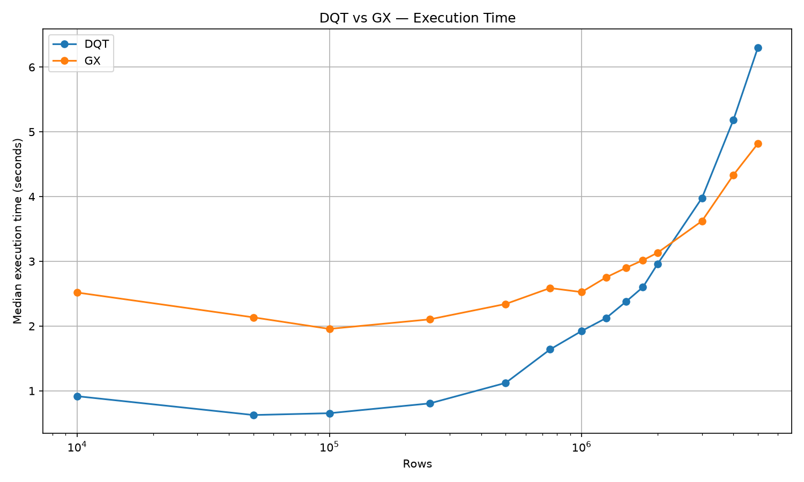

# Benchmark Results (NYC_Taxi_2015)

Path: `benchmark/spark/NYC_Taxi_2015`

The repository includes an existing benchmark run. Files of interest:

- `benchmark/spark/NYC_Taxi_2015/results.csv` — raw numeric results
- `benchmark/spark/NYC_Taxi_2015/benchmark.png` — plotted median execution time per framework

Summary (median execution time in seconds)

| Rows | DQT (median s) | GX (median s) |
|------:|---------------:|--------------:|
| 10,000 | 0.9166997070 | 2.5181197680 |
| 50,000 | 0.6259214030 | 2.1346994290 |
| 100,000 | 0.6539512600 | 1.9563745980 |
| 250,000 | 0.8053524950 | 2.1039118380 |
| 500,000 | 1.1224125110 | 2.3412364490 |
| 750,000 | 1.6392627260 | 2.5873217400 |
| 1,000,000 | 1.9234455920 | 2.5253120780 |
| 1,250,000 | 2.1229988070 | 2.7520266880 |
| 1,500,000 | 2.3775126060 | 2.9001269900 |
| 1,750,000 | 2.6012020390 | 3.0171032270 |
| 2,000,000 | 2.9574866170 | 3.1325937180 |
| 3,000,000 | 3.9782154970 | 3.6221422160 |
| 4,000,000 | 5.1871147620 | 4.3347665540 |
| 5,000,000 | 6.3023073310 | 4.8193388720 |

Full numeric results are available at: [benchmark/spark/NYC_Taxi_2015/results.csv](benchmark/spark/NYC_Taxi_2015/results.csv)

Plot of median execution time: 

Notes:

- The table above is taken directly from `results.csv` included in the repository. See `benchmark/spark/NYC_Taxi_2015/run_benchmark.py` for how the measurements were collected.
- Interpretation: these are per-run median wall-clock times measured by the harness; methodology and limitations are documented in `docs/benchmarking.md`.
